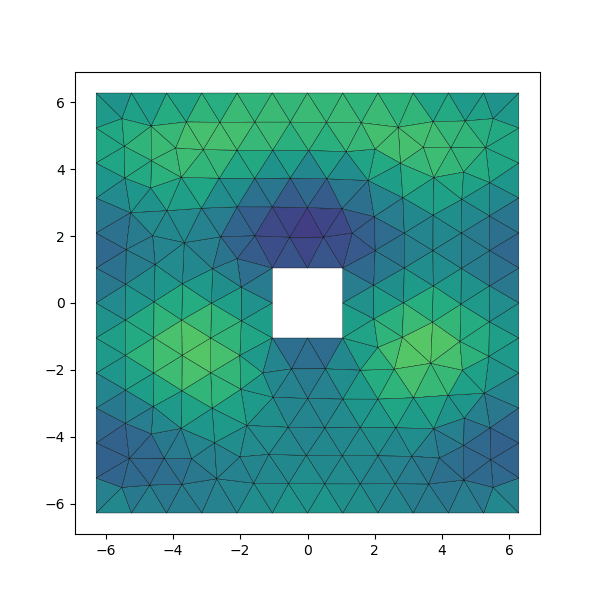
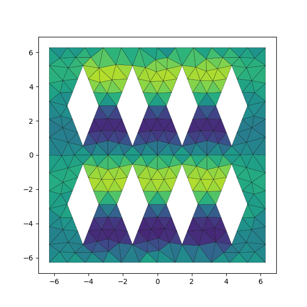

This repository contains research work for my master's thesis
"Discrete Exterior Calculus and Exact Controllability
for Time-Harmonic Acoustic Wave Simulation"
(TODO: add a link to the thesis once published).
This repo only contains brief descriptions of the simulated scenarios;
see the thesis for a tutorial on the methods used and discussion of results.

The simulations are implemented using the Python library [PyDEC]
by Nathan Bell and Anil N. Hirani.

## Simulations in this repo

Each Python file in the root `src/` directory implements a simulation.
`scatterer_control.py` implements the full DEC + exact controllability stack.
The rest are simpler cases designed for learning to use DEC
and testing parts of the implementation independently.

Short descriptions of the simulations in the order they were implemented:

### membrane.py

Dirichlet boundary condition $\phi = 0$
simulating a vibrating membrane rigidly attached
to a solid frame from all sides.

Unlike the rest of the simulations,
this one computes pressure and velocity on vertices and edges of the primal mesh
and features a 3D visualization.

### accuracy_test.py

A plane wave $\phi = -\cos(\omega t - \vec{\kappa} \cdot \mathbf{x})$,
where $\omega$ is the angular velocity of the wave
and $\vec{\kappa}$ is the direction of wave propagation scaled by the wavenumber,
travels through a square domain.
The wave is set as a Dirichlet boundary condition on the boundary
and computed using DEC in the interior of the domain.
Results are compared to the analytical solution (i.e. $\phi$)
to assess the accuracy of the DEC and its dependence on mesh element size.

### stability_test.py

The same scenario as `accuracy_test.py`,
but instead of measuring accuracy,
we search for the highest stable timestep length
and examine how it relates to mesh element size.

### scatterer_forward.py

The same plane wave $\phi$ used in `accuracy_test.py`
travels past a scattering obstacle.
We solve for the scattered wave by applying $\phi$
as a Dirichlet boundary condition on the obstacle's surface.
On the outer boundary of the domain we simulate open air
with a first-order absorbing Engquist-Majda boundary condition

$$
\frac{1}{c}\frac{\partial\phi}{\partial t} + \mathbf{n} \cdot \nabla\phi = 0.
$$

### scatterer_control.py

The same scenario as `scatterer_forward.py`.
Additionally, the exact controllability method is used
to drive the simulation into a time-periodic state.
This is the most complicated test case
and features a number of command line parameters.
Run `python src/scatterer_control.py --help`
for a list of parameters.

Here are a few animated results
along with the commands that produced them:

#### square

`python src/scatterer_control.py --shape square --save-visuals`

#### eight-pointed star

`python src/scatterer_control.py --shape star --star-points 8 --save-visuals`

#### twelve-pointed star

`python src/scatterer_control.py --shape star --star-points 12 --mesh-scaling 2 --wavenumber 2 --save-visuals`

#### diamonds

`python src/scatterer_control.py --shape diamonds --save-visuals`

## Running the code

You'll need the `gmsh` tool, a few Python libraries
(namely numpy, scipy, and matplotlib),
a whole bunch of C libraries (which you probably already have
unless you're on NixOS like I am, in which case you can use `nix-shell`),
and `./pydec` added to your `PYTHONPATH`.
See `shell.nix` for exact dependencies.

Remember to run `git submodule init && git submodule update` after cloning the
repo or clone with the `--recursive` option to get PyDEC.

[pydec]: https://github.com/hirani/pydec
